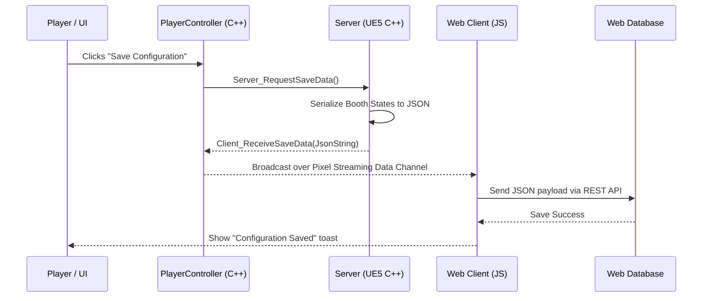
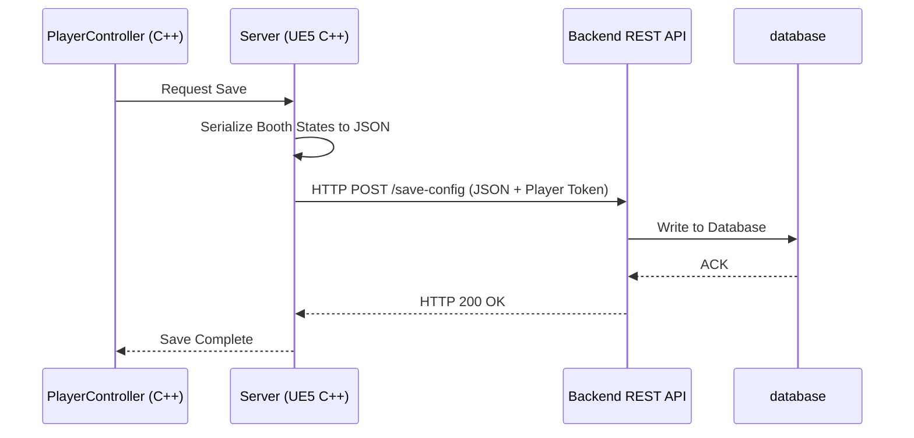

# Saving System Design for Multiplayer & Pixel Streaming

In a multiplayer Pixel Streaming environment, standard Unreal Engine saving (`USaveGame` writing to local disk) is insufficient. Because UE instances run on ephemeral cloud servers (like AWS EC2 or containerized auto-scaled tasks), local disks are wiped when instances scale down, and client data cannot be stored locally on server hardware.

This document recommends two approaches for structuring and organizing a robust saving system, with the **Browser-Centric (Data Channel) Approach** being the recommended choice for a web configurator like Maximall.

---

## 1. Architectural Approaches

### Option A: Browser-Centric (Data Channel) Saving — *RECOMMENDED*
This approach offloads persistence to the browser frontend and the web application's existing database. UE acts as a pure visual compiler.



#### Why it fits Pixel Streaming:
* **Ephemeral Servers**: UE instances can be spun up and terminated at any time without data loss.
* **No DB Credentials in UE**: The UE build doesn't need to know database connection strings, API keys, or handle user authorization. The web client handles all credentials and auth tokens.
* **Synchronized States**: The web client can easily tie configurations to user accounts, share configurations via web URLs, or export them to shopping carts.

---

### Option B: Server-to-API (Direct REST) Saving
The UE server communicates directly with a centralized backend database/API.



#### Why it fits standard multiplayer:
* **Anti-Cheat**: Prevents players from modifying JSON payloads in the browser console.
* **Instance Independence**: Server can load data even if the web socket or pixel streaming channel lags or disconnects.

---

## 2. Recommended Save System Structure

To keep the codebase clean, encapsulate the saving logic within a dedicated Manager component or subsystem:

```
Source/awsTutorial/
├── FurnitureConfigurator/
│   ├── Save/
│   │   ├── FurnitureSaveManager.h      <-- Coordinates Serialization/Deserialization
│   │   ├── FurnitureSaveManager.cpp
│   │   ├── FurnitureSaveTypes.h         <-- Holds JSON structure definitions
```

### C++ Component Implementation (`UFurnitureSaveManager`)

Create a `USaveGame`-like structure or a static helper library that handles serializing booth configurations into JSON formats.

#### `FurnitureSaveTypes.h`
Define the structural layout of the save state:
```cpp
#pragma once

#include "CoreMinimal.h"
#include "FurnitureConfigurator/Data/FurnitureTypes.h"
#include "FurnitureSaveTypes.generated.h"

USTRUCT(BlueprintType)
FBoothSaveEntry
{
    GENERATED_BODY()

    UPROPERTY(BlueprintReadWrite)
    FName BoothID; // Unique ID to identify which booth this config belongs to

    UPROPERTY(BlueprintReadWrite)
    FShowroomBoothConfigState ConfigState;
};

USTRUCT(BlueprintType)
FFurnitureSavePayload
{
    GENERATED_BODY()

    UPROPERTY(BlueprintReadWrite)
    FString SaveName;

    UPROPERTY(BlueprintReadWrite)
    TArray<FBoothSaveEntry> Booths;
};
```

#### `FurnitureSaveManager.h`
```cpp
#pragma once

#include "CoreMinimal.h"
#include "Subsystems/WorldSubsystem.h"
#include "FurnitureSaveTypes.h"
#include "FurnitureSaveManager.generated.h"

DECLARE_DYNAMIC_MULTICAST_DELEGATE_OneParam(FOnSaveCompleted, bool, bSuccess);
DECLARE_DYNAMIC_MULTICAST_DELEGATE_TwoParams(FOnLoadCompleted, bool, bSuccess, const FFurnitureSavePayload&, LoadedData);

UCLASS()
class AWSTUTORIAL_API UFurnitureSaveManager : public UWorldSubsystem
{
    GENERATED_BODY()

public:
    /** Scans the world for all AShowroomBooths and builds a save payload. */
    UFUNCTION(BlueprintCallable, Category = "MaxiMall | Save")
    FString GatherAndSerializeWorldState(const FString& SaveName);

    /** Parses a JSON string and updates the booths in the world. (Runs on Server) */
    UFUNCTION(BlueprintCallable, BlueprintAuthorityOnly, Category = "MaxiMall | Save")
    bool DeserializeAndApplyWorldState(const FString& JsonData);

    // REST API Direct Saving (Option B fallback)
    UFUNCTION(BlueprintCallable, Category = "MaxiMall | Save")
    void SaveToServerAPI(const FString& UserToken, const FString& SaveName);

    UFUNCTION(BlueprintCallable, Category = "MaxiMall | Save")
    void LoadFromServerAPI(const FString& UserToken);

    UPROPERTY(BlueprintAssignable, Category = "MaxiMall | Save")
    FOnSaveCompleted OnSaveCompleted;

    UPROPERTY(BlueprintAssignable, Category = "MaxiMall | Save")
    FOnLoadCompleted OnLoadCompleted;
};
```

#### `FurnitureSaveManager.cpp` (JSON Serialization Logic)
```cpp
#include "FurnitureSaveManager.h"
#include "FurnitureConfigurator/ShowroomBooth.h"
#include "JsonObjectConverter.h"
#include "EngineUtils.h"

FString UFurnitureSaveManager::GatherAndSerializeWorldState(const FString& SaveName)
{
    FFurnitureSavePayload Payload;
    Payload.SaveName = SaveName;

    // Gather data from all booths in the level
    for (TActorIterator<AShowroomBooth> It(GetWorld()); It; ++It)
    {
        AShowroomBooth* Booth = *It;
        if (Booth)
        {
            FBoothSaveEntry Entry;
            // Use actor name or a custom ID property as the key
            Entry.BoothID = FName(*Booth->GetName());
            Entry.ConfigState = Booth->ActiveState;
            Payload.Booths.Add(Entry);
        }
    }

    // Convert Struct to JSON String
    FString JsonStr;
    if (FJsonObjectConverter::UStructToJsonObjectString(Payload, JsonStr))
    {
        return JsonStr;
    }

    return TEXT("{}");
}

bool UFurnitureSaveManager::DeserializeAndApplyWorldState(const FString& JsonData)
{
    if (!GetWorld() || !GetWorld()->GetNetMode() != NM_Client)
    {
        // Must be run on server to apply changes to replicated variables
        return false;
    }

    FFurnitureSavePayload LoadedPayload;
    if (!FJsonObjectConverter::JsonObjectStringToUStruct(JsonData, &LoadedPayload, 0, 0))
    {
        return false;
    }

    // Map booths by Name for quick lookup
    TMap<FName, AShowroomBooth*> BoothMap;
    for (TActorIterator<AShowroomBooth> It(GetWorld()); It; ++It)
    {
        AShowroomBooth* Booth = *It;
        if (Booth)
        {
            BoothMap.Add(FName(*Booth->GetName()), Booth);
        }
    }

    // Apply config states
    for (const FBoothSaveEntry& Entry : LoadedPayload.Booths)
    {
        AShowroomBooth** FoundBooth = BoothMap.Find(Entry.BoothID);
        if (FoundBooth && *FoundBooth)
        {
            // Apply product and size/color configurations on the server
            (*FoundBooth)->RequestProductChange(Entry.ConfigState.ProductID);
            
            // Reapply component configurations
            (*FoundBooth)->RequestComponentSelection(EFurnitureComponentType::Cabinet, Entry.ConfigState.ActiveSizeIndex, Entry.ConfigState.ActiveColorIndex);
            (*FoundBooth)->RequestComponentSelection(EFurnitureComponentType::Countertop, Entry.ConfigState.CountertopSizeIndex, Entry.ConfigState.ActiveCountertopColorIndex);
            (*FoundBooth)->RequestComponentSelection(EFurnitureComponentType::Closet, Entry.ConfigState.ClosetSizeIndex, Entry.ConfigState.ClosetColorIndex);
            (*FoundBooth)->RequestComponentSelection(EFurnitureComponentType::Sink, Entry.ConfigState.SinkSizeIndex, Entry.ConfigState.SinkColorIndex);
            (*FoundBooth)->RequestComponentSelection(EFurnitureComponentType::Faucet, Entry.ConfigState.FaucetSizeIndex, Entry.ConfigState.FaucetColorIndex);
            (*FoundBooth)->RequestComponentSelection(EFurnitureComponentType::Mirror, Entry.ConfigState.MirrorSizeIndex, Entry.ConfigState.MirrorColorIndex);
        }
    }

    return true;
}
```

---

## 3. Pixel Streaming Integration Details (Option A)

### Sending Data to Web Client
In your Player Controller (e.g. `AAwsTutorial_PlayerController`):
```cpp
void AAwsTutorial_PlayerController::SendSaveToWebClient(const FString& JsonSaveData)
{
    if (!IsLocalController() || !IPixelStreamingModule::IsAvailable()) return;

    IPixelStreamingModule& PSModule = IPixelStreamingModule::Get();
    // Prefix payload so JavaScript frontend knows this is a save message
    const FString Payload = FString::Printf(TEXT("SaveConfig %s"), *JsonSaveData);

    const FPixelStreamingInputMessage* ResponseMsg = FPixelStreamingInputProtocol::FromStreamerProtocol.Find(TEXT("Response"));
    if (ResponseMsg)
    {
        uint8 ResponseTypeId = ResponseMsg->GetID();
        PSModule.ForEachStreamer([ResponseTypeId, &Payload](TSharedPtr<IPixelStreamingStreamer> Streamer)
        {
            if (Streamer.IsValid())
            {
                Streamer->SendPlayerMessage(ResponseTypeId, Payload);
            }
        });
    }
}
```

### Receiving Data from Web Client
In the JavaScript frontend page, send the JSON string back:
```javascript
// Web browser client inputs the config
let saveString = JSON.stringify(userSavedObject);
// Send over data channel using PixelStreaming protocol
pixelStreaming.emitUIInteraction({ "LoadConfig": saveString });
```

In Unreal Engine, hook into `UPixelStreamingInput` delegates to catch the incoming JSON configuration:
```cpp
// Within your Player Controller input parsing
void AAwsTutorial_PlayerController::HandlePixelStreamingInput(const FString& Descriptor)
{
    TSharedPtr<FJsonObject> JsonObject;
    TSharedRef<TJsonReader<>> Reader = TJsonReaderFactory<>::Create(Descriptor);

    if (FJsonSerializer::Deserialize(Reader, JsonObject) && JsonObject.IsValid())
    {
        if (JsonObject->HasField(TEXT("LoadConfig")))
        {
            FString LoadPayload = JsonObject->GetStringField(TEXT("LoadConfig"));
            
            // Call server RPC to update the world booths
            Server_ApplyLoadPayload(LoadPayload);
        }
    }
}
```

---

## 4. Key Recommendations

1. **Keep UE Ephemeral**: Do not store state files on the UE host machine. Choose **Option A** (Browser-Centric) if Maximall is embedded in a dashboard website. The web application's node/python backend is better suited for handling secure DB CRUD requests.
2. **Server-Side Validation**: When the server receives a `LoadConfig` JSON string, it must validate it. Never trust client inputs directly. Validate that:
   * Sizing and color indices match the options defined inside the product rows.
   * Player has permissions to modify the booths.
3. **Handle Versioning Proactively**: In the JSON structs (like `FFurnitureSavePayload`), include a `Version` integer. If you update your meshes or option indices in a future sprint, you can implement a translator class to update older save structures rather than crashing or applying mismatching indexes.
4. **Url Query Loading on Startup**: For seamless loading (e.g. sharing a design link with a client), pass the configuration ID as a URL query param. The Player Controller can fetch this param via `GetRequestOption("config_id")` on `BeginPlay` and pull the data from the server automatically before the player even clicks anything.
