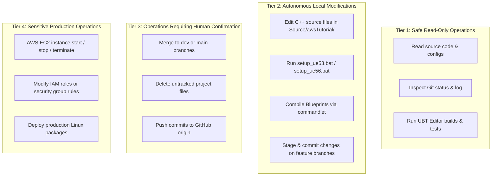

# AI Access & Permissions Operational Guide — MaxiMall Platform

> **Purpose**: Definitive operational access boundaries, security rules, and setup instructions for AI coding agents (Antigravity, Claude Code, etc.) across the MaxiMall repositories.  
> **Security Policy**: Zero plaintext secrets or credentials in Git. Describe credential locations and mechanisms, never secret values.  

---

## 1. Access Scopes & Permission Levels

---

## 2. Operations Classification

### 2.1 Tier 1: Safe Read-Only (Unrestricted)
- Reading `.cpp`, `.h`, `.ini`, `.json`, `.ts`, `.md`, and build files.
- Inspecting `git status`, `git branch -a`, `git log`.
- Running compiler diagnostic checks.

### 2.2 Tier 2: Local Modifying Operations (Autonomous)
- Editing C++ classes in `Source/awsTutorial/`.
- Switching active build profiles via `setup_ue53.bat` or `setup_ue56.bat`.
- Running Unreal Engine compilation (`Build.bat`).
- Running `CompileAllBlueprintsCommandlet` and map load verifications.
- Creating local Git commits on developer branches (`narek/*`, `artur/*`).

### 2.3 Tier 3: Human Confirmation Required
- Deleting files or directories from the repository.
- Merging feature branches into `dev` or `main`.
- Pushing local branches to `origin`.

### 2.4 Tier 4: Sensitive Production Operations (Strict Safety)
- Modifying live AWS infrastructure or launching GPU instances outside automated scaling.
- Changing security group rules or VPC subnet configurations.
- Altering production build profiles or deployment pipelines.

---

## 3. Toolchain & Environment Requirements for New AI Agents

To onboard an AI agent onto a development machine, ensure the following toolchain is available:

### PC1 (Development Machine — Narek):
1. **Unreal Engine**: Version `5.3.2` installed at `C:\Program Files\Epic Games\UE_5.3\`.
2. **Visual Studio**: Visual Studio 2022 with MSVC `v143` C++ toolchain and Windows 10/11 SDK.
3. **.NET SDK**: .NET 6.0 and .NET 8.0 SDKs (required for UnrealBuildTool and Epic commandlets).
4. **Git Client**: Standard Git CLI with credential helper configured.
5. **Node.js**: Node.js 18+ or 20+ LTS (for testing `maximall-web` and `maximall-pixel-config`).

### PC2 (Production Build Machine — Artur):
1. **Unreal Engine**: Version `5.6` installed for packaging Linux Client and Server targets.
2. **Linux Cross-Compilation Toolchain**: Installed for packaging Linux binaries from Windows.
3. **Visual Studio 2022**: C++ Game Development workload installed.

---

## 4. Credential Management & Security Rules

> [!CAUTION]
> ### STRICT SECURITY POLICIES
> 1. **No Embedded PATs in Git**: Remote URLs must always use clean HTTPS URLs (`https://github.com/adavtyan815-art/...`) without embedded credentials.
> 2. **No Hardcoded API Keys**: AWS access keys, SSH private keys, and session secrets must reside strictly in local `.env` or system environment variables. Never commit `.env` files.
> 3. **SSH Key Protection**: Private keys (e.g. `maximall-temp.pem`) must remain in secure local user directories with `chmod 400` equivalent permissions.

---
*Document Version: 1.0.0 — AI Access & Permissions Operational Guide*
