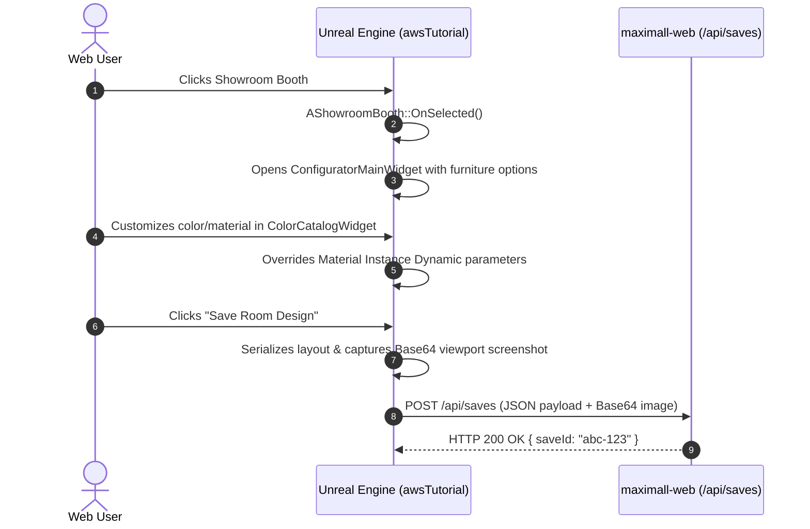

# awsTutorial Unreal Engine Project: Master Architecture & Universal Guide

> **Repository**: `https://github.com/adavtyan815-art/ue5maximall.git`  
> **Primary Module**: `awsTutorial` (`Source/awsTutorial/` — 42 functional C++ source files)  
> **Engine Compatibility**: Dual-Engine Architecture (Unreal Engine 5.3 on PC1 / Unreal Engine 5.6 on PC2)  
> **Production Packaging**: Performed exclusively on PC2 (UE 5.6) for Linux Client/Server deployment on AWS GPU instances (`g4dn.2xlarge`).  

---

## Table of Contents
1. [Project Overview & Dual-Developer Architecture](#1-project-overview--dual-developer-architecture)
2. [Module Architecture & Source Tree Structure](#2-module-architecture--source-tree-structure)
3. [Core C++ Systems & Major Classes](#3-core-c-systems--major-classes)
4. [Blueprint & Level Asset Hierarchy](#4-blueprint--level-asset-hierarchy)
5. [Runtime User Flows](#5-runtime-user-flows)
6. [C++ Development Guidelines: Modifying & Adding Classes](#6-c-development-guidelines-modifying--adding-classes)
7. [Decoupled Build Target Profile Architecture](#7-decoupled-build-target-profile-architecture)
8. [Git Branching Model & Binary Asset Safety](#8-git-branching-model--binary-asset-safety)
9. [Subsystem Verification & Testing Matrix](#9-subsystem-verification--testing-matrix)
10. [External Ecosystem Interfaces & Contracts](#10-external-ecosystem-interfaces--contracts)
11. [Protected Invariants & Known Proven Issues](#11-protected-invariants--known-proven-issues)

---

## 1. Project Overview & Dual-Developer Architecture

`awsTutorial` is the interactive 3D Web application powering the MaxiMall showroom, dynamic furniture configurator, and procedural room planner.

```mermaid
flowchart TD
    subgraph SharedGit [GitHub Repository: ue5maximall]
        DevBranch[dev branch]
        SourceTree[Source/awsTutorial/ (42 Functional C++ Files)]
        ContentTree[Content/ (Blueprints, Maps, Meshes, Materials)]
    end

    subgraph PC1 [PC1: Narek (Unreal Engine 5.3)]
        TargetPC1[Build/Targets/PC1_UE53/ -> setup_ue53.bat]
        EditorPC1[Local Development / PIE / Blueprint Editing]
    end

    subgraph PC2 [PC2: Artur (Unreal Engine 5.6)]
        TargetPC2[Build/Targets/PC2_UE56/ -> setup_ue56.bat]
        PackagePC2[Production Linux Client & Server Packaging]
    end

    subgraph AWSWorkload [AWS GPU Instance (g4dn.2xlarge)]
        LinuxBinary[awsTutorialClient / Server Linux Binaries]
        PixelStreaming[Pixel Streaming WebRTC Streamer]
    end

    DevBranch <--> PC1
    DevBranch <--> PC2
    PC1 --> EditorPC1
    PC2 --> PackagePC2
    PackagePC2 --> AWSWorkload
```

---

## 2. Module Architecture & Source Tree Structure

```
MaxiMall (Project Root)
├── awsTutorial.uproject                  # Canonical Unreal Engine project descriptor
├── setup_ue53.bat                        # PC1 setup script: activates UE 5.3 build targets
├── setup_ue56.bat                        # PC2 setup script: activates UE 5.6 build targets
├── Build/
│   └── Targets/
│       ├── PC1_UE53/                     # Proven PC1 (UE 5.3) Target.cs files (4 files)
│       └── PC2_UE56/                     # Proven PC2 (UE 5.6) Target.cs files (4 files)
├── Config/                               # Project-wide configuration files
│   ├── DefaultEngine.ini                 # Rendering, Pixel Streaming, and PSO settings
│   ├── DefaultGame.ini                   # Game mode and project metadata
│   ├── DefaultInput.ini                  # Action and axis mappings
│   └── DefaultEditor.ini                 # Editor preferences
├── Content/                              # Unreal Engine binary assets
│   ├── MaxiMall.umap                     # Master interactive 3D level
│   ├── Blueprints/                       # Gameplay & UI Blueprints (BP_PlayerController, etc.)
│   ├── DataTables/                       # Furniture & Material catalog DataTables
│   └── Meshes/ Materials/ Textures/      # 3D assets
├── Source/
│   ├── awsTutorial.Target.cs             # [GITIGNORED] Machine-active Game target
│   ├── awsTutorialEditor.Target.cs       # [GITIGNORED] Machine-active Editor target
│   ├── awsTutorialClient.Target.cs       # [GITIGNORED] Machine-active Client target
│   ├── awsTutorialServer.Target.cs       # [GITIGNORED] Machine-active Server target
│   └── awsTutorial/                      # [CANONICAL C++ MODULE — 42 Source Files]
│       ├── awsTutorial.Build.cs          # Module dependency declarations
│       ├── awsTutorial.cpp / .h          # Primary game module implementation
│       ├── awsTutorial_PlayerController.cpp / .h  # Core player controller & Pixel Streaming hooks
│       ├── awsTutorial_LoginPlayerController.cpp / .h # Authentication & landing controller
│       ├── ColorCatalog/                 # Material & color customization subsystem
│       │   ├── ColorCatalogSubsystem.cpp / .h
│       │   ├── ColorCatalogWidget.cpp / .h
│       │   ├── ColorCatalogSwatchWidget.cpp / .h
│       │   ├── ColorCatalogItemObject.h
│       │   └── ColorCatalogTypes.h
│       ├── Constructor/                  # Procedural room planning subsystem
│       │   ├── ProceduralWallActor.cpp / .h
│       │   ├── RoomPlannerManager.cpp / .h
│       │   └── RoomPlannerTypes.h
│       └── FurnitureConfigurator/        # Showroom booth & furniture configuration
│           ├── ShowroomBooth.cpp / .h    # Interactive showroom display booth
│           ├── BoothInteractionInterface.h # Interface for booth raycast/click events
│           ├── Data/
│           │   └── FurnitureTypes.cpp / .h # Data structs & enums for furniture catalog
│           ├── Preview/
│           │   └── FurniturePreviewActor.cpp / .h # Real-time 3D furniture preview
│           └── UI/
│               ├── ConfiguratorMainWidget.cpp / .h
│               ├── FurnitureGridItemWidget.cpp / .h
│               ├── FurnitureSizePillWidget.cpp / .h
│               ├── RoomPlannerWidget.cpp / .h
│               ├── SaveHistoryItemWidget.cpp / .h
│               ├── SaveSystemWidget.cpp / .h
│               └── ViewmodeOverlayWidget.cpp / .h
└── docs/                                 # Official Project Documentation
    ├── CLAUDE.md                         # AI agent concise entry point
    ├── AWSTUTORIAL_GUIDE.md              # THIS MASTER GUIDE
    ├── PC1_ECOSYSTEM_INTEGRATION.md      # Ecosystem & external contracts guide
    └── AI_ACCESS_AND_PERMISSIONS.md      # Operational access & permissions guide
```

---

## 3. Core C++ Systems & Major Classes

### 3.1 Player Controllers
- **`AawsTutorial_PlayerController`**:
  - Primary interactive controller for the showroom and constructor.
  - Manages camera orbit, pan, and zoom navigation.
  - Houses the Pixel Streaming input handler and late-bind hooks (`AddUniqueDynamic` in `PlayerTick`).
  - Processes bidirectional clipboard synchronization and external URL redirection via data channels.
- **`AawsTutorial_LoginPlayerController`**:
  - Lightweight controller for the initial landing / authentication viewport.

### 3.2 Showroom & Furniture Customization (`FurnitureConfigurator/`)
- **`AShowroomBooth`**:
  - Central interactive booth actor placed throughout `MaxiMall.umap`.
  - Implements `IBoothInteractionInterface` for selection, highlight outline rendering, and theme swapping.
- **`AFurniturePreviewActor`**:
  - Spawns isolated 3D furniture meshes in real-time within the studio preview stage.
  - Supports dynamic material parameter overrides (color, roughness, normal strength).

### 3.3 Procedural Room Constructor (`Constructor/`)
- **`URoomPlannerManager`**:
  - Manages 2D grid placement, wall snapping, dimensional calculations, and furniture layout state.
- **`AProceduralWallActor`**:
  - Procedurally generates dynamic wall meshes with custom thickness, height, cutouts for doors/windows, and runtime material assignment.

### 3.4 Color & Material Catalog (`ColorCatalog/`)
- **`UColorCatalogSubsystem`**:
  - Engine game instance subsystem indexing all available material swatch collections, RAL color palettes, and finish presets.
- **`UColorCatalogWidget`**:
  - UI panel providing interactive color pickers, material swatch grids, and category filtering.

---

## 4. Blueprint & Level Asset Hierarchy

- **Master Level**: `/Game/MaxiMall` (`Content/MaxiMall.umap`).
- **Core Blueprints**:
  - `BP_MaxiMallPlayerController` (`Content/FurnitureConfigurator/BP_MaxiMallPlayerController.uasset` — Derived from `AawsTutorial_PlayerController`).
  - `BP_ShowroomBooth` (`Content/FurnitureConfigurator/Blueprints/BP_ShowroomBooth.uasset` — Derived from `AShowroomBooth`).
  - `BP_FurniturePreviewActor` (`Content/FurnitureConfigurator/Blueprints/BP_FurniturePreviewActor.uasset` — Derived from `AFurniturePreviewActor`).
  - `WBP_SaveSystem`, `WBP_SaveHistoryItem`, `WBP_RoomPlannerWidget`, `WBP_ColorCatalog` (UI Widgets).
- **Native Procedural Actors**:
  - `AProceduralWallActor`: Spawned dynamically at runtime by `URoomPlannerManager` (native C++ procedural mesh generation; no standalone Blueprint asset).
- **DataTables (`Content/DT/`)**:
  - `DT_FurnitureCatalog`: Contains furniture model IDs, meshes, dimension limits, and component options.
  - `DT_SharedCountertops`: Contains shared countertop model IDs and static mesh options.
  - `DT_SharedSinks`: Contains shared sink model IDs and static mesh options.
  *(Note: Material catalogs and RAL color palettes are indexed programmatically via `UColorCatalogSubsystem`).*

---

## 5. Runtime User Flows



---

## 6. C++ Development Guidelines: Modifying & Adding Classes

### 6.1 Modifying Existing Classes
- Keep all function signatures compatible across Unreal Engine 5.3 and 5.6.
- Avoid engine-version-specific deprecated APIs without preprocessor guards (`#if ENGINE_MAJOR_VERSION == 5 && ENGINE_MINOR_VERSION >= 6`).

### 6.2 Adding a New C++ Class
1. Place `.h` in `Source/awsTutorial/Public/` or subsystem subdirectory.
2. Place `.cpp` in `Source/awsTutorial/Private/` or subsystem subdirectory.
3. Include `"awsTutorial.h"` or module headers.
4. Ensure the `AWSTUTORIAL_API` export macro is present on class declarations:
   ```cpp
   #pragma once
   #include "CoreMinimal.h"
   #include "GameFramework/Actor.h"
   #include "MyNewActor.generated.h"

   UCLASS()
   class AWSTUTORIAL_API AMyNewActor : public AActor
   {
       GENERATED_BODY()
   public:
       AMyNewActor();
   };
   ```
5. Compile via UBT on PC1 (`Build.bat awsTutorialEditor Win64 Development ...`).

---

## 7. Decoupled Build Target Profile Architecture

Because PC1 uses UE 5.3 and PC2 uses UE 5.6, the active `Source/*.Target.cs` files are decoupled from Git:

```
Build/Targets/
├── PC1_UE53/                     # 4 Target.cs files tuned for UE 5.3 on PC1
│   ├── awsTutorial.Target.cs
│   ├── awsTutorialEditor.Target.cs
│   ├── awsTutorialClient.Target.cs
│   └── awsTutorialServer.Target.cs
└── PC2_UE56/                     # 4 Proven Target.cs files tuned for UE 5.6 on PC2
    ├── awsTutorial.Target.cs
    ├── awsTutorialEditor.Target.cs
    ├── awsTutorialClient.Target.cs
    └── awsTutorialServer.Target.cs
```

### Activation Scripts:
- **On PC1**: Run `setup_ue53.bat` to copy `Build/Targets/PC1_UE53/*.Target.cs` into `/Source/`.
- **On PC2**: Run `setup_ue56.bat` to copy `Build/Targets/PC2_UE56/*.Target.cs` into `/Source/`.
- **Git Protection**: `/Source/*.Target.cs` is included in `.gitignore` to prevent machine-specific drift.

---

## 8. Git Branching Model & Binary Asset Safety

### 8.1 Branch Structure
- **`narek/*`**: Feature branches for PC1 development.
- **`artur/*`**: Feature branches for PC2 packaging and build updates.
- **`dev`**: Shared integration branch. All feature branches merge here for cross-engine testing.
- **`main`**: Protected production branch. Only updated after PC2 verified packaging.

### 8.2 Binary Asset Single-Writer Rule
- Binary Unreal assets (`.uasset`, `.umap`) **cannot be merged** via Git text merge tools.
- **Protocol**: Only one developer may edit a specific Blueprint or Map file at a time. Coordinate ownership before modifying `/Game/MaxiMall.umap` or shared widgets.

---

## 9. Subsystem Verification & Testing Matrix

| Test Step | Command / Procedure | Expected Result |
|---|---|---|
| **1. Target Setup** | `setup_ue53.bat` (PC1) | 4 Target files copied to `/Source/` |
| **2. C++ Compilation** | `Build.bat awsTutorialEditor Win64 Development ...` | `Exit code 0` (0 errors) |
| **3. Blueprint Compile** | `UnrealEditor-Cmd.exe ... -run=CompileAllBlueprints` | `0 errors, 0 warnings` |
| **4. Level Load** | `UnrealEditor-Cmd.exe ... /Game/MaxiMall` | Clean exit with code 0 |

---

## 10. External Ecosystem Interfaces & Contracts
 
1. **`maximall-web` Backend**:
   - Save/Load API: `GET /api/saves/:username`, `POST /api/saves`, `DELETE /api/saves/:username/:saveId`.
   - Host URL Parameter: Passed via command line `-BackendURL=http://172.31.x.x:3000` (or `https://...`).
   - Implementation: `USaveSystemWidget` serializes showroom booth configurations to JSON and exchanges REST payloads via `FHttpModule`.
2. **`maximall-pixel-config` Infrastructure**:
   - Streamer Port: Connects to local Wilbur signaling on `ws://127.0.0.1:8888`.
   - Data Channel Commands: `open_url: %s` for browser tab opening, mouse hover events for cursor sync.

---

## 11. Protected Invariants & Known Proven Issues

> [!IMPORTANT]
> ### UNREAL ENGINE INTEGRITY RULES
> 1. **Canonical Source Path**: Never rename `Source/awsTutorial/` or create duplicate module folders.
> 2. **Never Git-Track `/Source/*.Target.cs`**: Keep active Target files gitignored and managed via `setup_ue53.bat` / `setup_ue56.bat`.
> 3. **Headless Linux Display on AWS**: Production Linux Client on AWS EC2 must bind to virtual framebuffer (`Xvfb :0`) without `-RenderOffScreen` so Vulkan renders properly.
> 4. **No BIM or ShowroomBoothAll Classes**: All booth interaction is consolidated in `AShowroomBooth`.

---
*Document Version: 1.2.0 — Canonical Universal Guide for awsTutorial*
